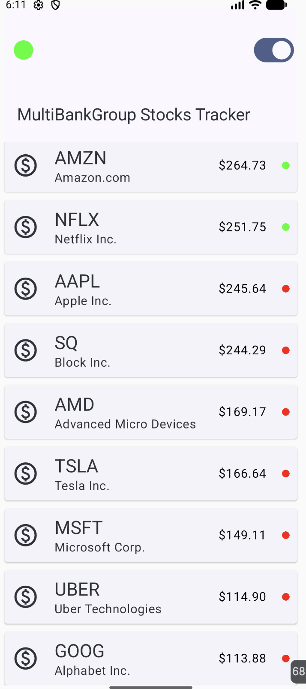
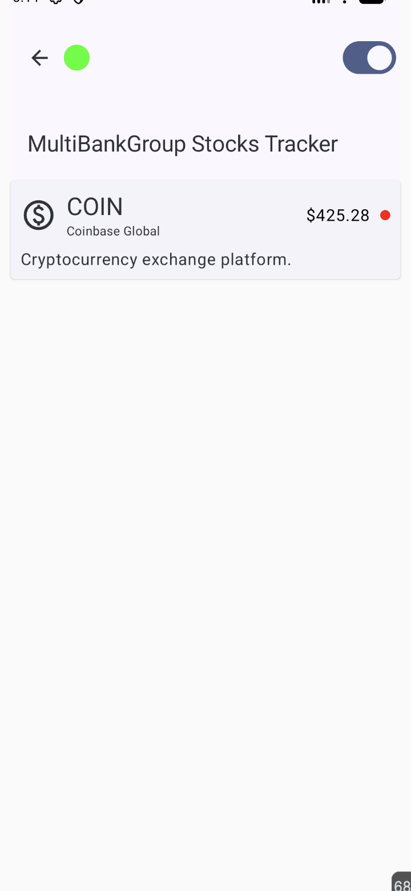

## 📸 Screenshots

### Feed Screen

### Details Screen

📱 Real-Time Stock Price Tracker

A modern Android app built with Jetpack Compose that displays real-time stock price updates using WebSocket simulation.

🚀 Features

	•	📊 Real-time price updates for 25+ stocks
	•	🔌 WebSocket integration (echo server simulation)
	•	📈 Price change indicators (↑ / ↓ with animation)
	•	🟢 Connection status indicator
	•	▶️ Start / Stop live feed
	•	📄 Details screen per stock
	•	🔄 Shared state across screens

  🧱 Architecture

This project follows MVVM + Clean Architecture principles:

UI (Compose)

   ↓
   
ViewModel

   ↓
   
Repository (Single Source of Truth)
   
   ↓
   
ManagePriceUpdateUseCase (business logic) domain layer
   
   ↓
   
WebSocketManager (data source)

⚙️ Tech Stack

	•	Kotlin
	•	Jetpack Compose
	•	Navigation Compose
	•	Kotlin Coroutines + Flow
	•	Hilt (Dependency Injection)
	•	OkHttp WebSocket

  🔌 How it works
  
	1.	ManagePriceUpdateUseCase generates random prices every 2 seconds
	2.	Sends updates via WebSocket
	3.	Echo server returns the same data
	4.	Repository processes updates
	5.	UI observes via StateFlow

🧠 Key Decisions

	•	✅ Single WebSocket connection shared across app
	•	✅ State managed via StateFlow
	•	✅ scan() used for incremental updates
	•	✅ Navigation passes stockId with SavedStateHandle

  🎨 UI Highlights
  
	•	Smooth transitions
	•	Clean Compose-based UI
  •	🔄 Real-time sorting

  ⚠️ Notes
	•	Used public WebSocket echo server wss://echo.websocket.org instead of wss://ws.postman-echo.com/raw 
  cus it keep droping down

  🧑‍💻 Author

Mohammed Elsadig
